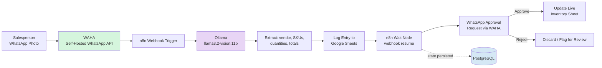

# Local AI Inventory Management Automation

A fully local, zero-cost AI pipeline that turns a photo of a receipt into an approved, logged inventory update — no cloud APIs, no recurring costs, no client data leaving the premises.

## Problem Statement

Small businesses typically log purchase and sales receipts by hand into spreadsheets, a process that's slow, error-prone, and easy to fall behind on when a salesperson is on the floor all day. This pipeline replaces manual data entry with a photo-to-approval flow: snap a receipt on WhatsApp, a local vision LLM extracts the line items, a manager approves with a tap, and inventory updates itself.

## Architecture



All components run in Docker Compose on a single host: Ollama serves the vision model, n8n orchestrates the workflow, WAHA bridges WhatsApp, and PostgreSQL persists Wait node state across restarts.

## Demo

*[Add a screen recording here: upload receipt → WhatsApp approval message arrives → tap approve → Google Sheet updates live. A GIF under ~10MB embeds directly — `` — otherwise link to a hosted video.]*

## Repo Layout

```
.
├── docker-compose.yml              # Ollama, n8n, WAHA, PostgreSQL
├── .env.example                    # copy to .env and fill in
├── workflows/
│   └── inventory-pipeline.json     # importable n8n workflow
├── prompts/
│   └── receipt-extraction-prompt.txt  # vision model prompt contract
└── scripts/
    └── setup.sh                    # one-shot bring-up + model pull
```

## Setup

1. Install Docker and Docker Compose on the host machine.
2. Clone this repo, then run `cp .env.example .env` and fill in `POSTGRES_PASSWORD`, `N8N_ENCRYPTION_KEY`, `WAHA_API_KEY`, and `APPROVER_WHATSAPP_NUMBER`.
3. Run `./scripts/setup.sh` — it starts Docker Compose (Ollama, n8n, WAHA, PostgreSQL) and pulls `llama3.2-vision:11b`.
4. Open WAHA at `localhost:3000`, scan the QR code with the salesperson's WhatsApp to link the session.
5. Open n8n at `localhost:5678`, add Google Sheets/Drive OAuth2 credentials.
6. Import `workflows/inventory-pipeline.json` into n8n (Workflows → Import from File) and reconnect the Google Sheets credential (marked `REPLACE_ME`).
7. Paste the contents of `prompts/receipt-extraction-prompt.txt` into the "Ollama Vision Extraction" node's prompt field.
8. Point WAHA's webhook at `http://n8n:5678/webhook/waha-incoming` and activate the workflow in n8n.
9. Send a test receipt photo to the linked WhatsApp number and confirm it reaches the webhook trigger and logs to Google Sheets.
10. Reply YES to the approval message and verify the Live Inventory sheet updates.

## Key Architectural Decisions

- **Ollama over cloud vision APIs** — Running llama3.2-vision:11b locally eliminates per-call API costs and keeps receipt images and extracted business data entirely on-premises, which matters for SMB clients handling vendor and pricing data.
- **n8n Wait node with webhook resume over polling** — The approval step can sit idle for minutes or hours waiting on a human. Webhook resume means the workflow consumes zero compute while waiting, instead of a polling loop repeatedly checking approval status.
- **PostgreSQL over n8n's default SQLite** — SQLite doesn't reliably preserve Wait node state across container restarts. Moving n8n's backing store to PostgreSQL ensures an in-flight approval survives a restart or crash without losing the pending workflow.
- **WAHA over a paid WhatsApp Business API** — Self-hosting WhatsApp via WAHA avoids per-message costs and third-party API dependencies for a channel that's just used internally between salespeople and a manager.

## Skills Practiced

- Local LLM inference (running and prompting a vision model via Ollama)
- Docker networking (multi-container service discovery across Ollama, n8n, WAHA, PostgreSQL)
- Webhook architecture (trigger webhooks, wait/resume patterns for human-in-the-loop approval)
- API integration (Google Sheets API, Google Drive API, WhatsApp via WAHA)
